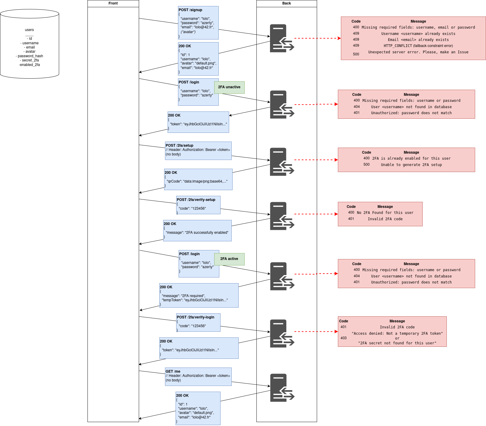

# 🔐 JWT & TOTP-Based 2FA Authentication Flow

## 📚 Glossary

- **JWT** – JSON Web Token: Proof of authentication, signed by the backend.
- **2FA** – Two-Factor Authentication: Adds a one-time code on top of username/password.
- **TOTP** – Time-Based One-Time Password: 6-digit code renewed every 30s.
- **tempToken** – Temporary JWT used to verify 2FA only.
- **secret_2fa** – Per-user secret used to generate TOTP codes.

---

## 🔄 Flow Description

### Case 1 – 2FA is disabled

```text
Frontend → POST /login (username + password)
Backend → 200 OK + JWT
Frontend → stores token → accesses protected routes
```

### Case 2 – 2FA is enabled

```text
Frontend → POST /login
Backend → 200 OK + tempToken (twofa_pending: true)

Frontend → prompts for TOTP code
Frontend → POST /2fa/verify-login + code + tempToken
Backend → 200 OK + final JWT
Frontend → stores token → accesses protected routes
```
## 🧠 3. Schéma Draw.io



---

### 🗂️ Key Routes
Route	Method	Description
/2fa/setup	POST	Generates QR code and secret
/2fa/verify-setup	POST	Verifies code and activates 2FA
/login	POST	Returns full token or tempToken
/2fa/verify-login	POST	Verifies TOTP, returns final JWT
/2fa/disable	POST	(to be implemented)
🖼️ Schema

### 🧪 To Test

    Login without 2FA → direct token

    Login with 2FA → tempToken + verification

    Try accessing protected route with tempToken → should fail

    Try invalid codes → should return 401


